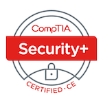

# 👋 Hi, I'm Vedant Soni

---

🔐 **Cybersecurity Enthusiast | Reverse Engineer**

I’m currently pursuing my **Master’s in Computer Science at Arizona State University**, with a research focus on **analyzing type inference in decompilers** at SEFCOM Labs @ ASU. I love playing CTFs, specializing in Reverse Engineering and Binary Exploitation and creating cool tools that make reverse engineering easier and more efficient.

---

## 💻 Tech Stack

### 🧠 Languages

--

### 🧰 Tools & Frameworks

#### 🔄 Binary Reverse Engineering

#### 🤖 Android Reversing

#### 💥 Binary Exploitation

#### 🌐 Networking & Packet Analysis

#### 🔸 Web Security & Exploitation Frameworks

#### 💻 Operating Systems

---

## 🎯 CTF and Community

- 🥷 **CTF Team Member** – Shellphish & ASU Hacking Club  
- 🟢 **pwn.college Green Belt** – Specializing in Reverse Engineering and Pwning  
- ⚔️ Active on HackTheBox & HackerOne (Web, RE, Network)

---

## 🚀 Projects

**🔸 Android Malware Reverse Engineering**  
→ Decompiled & analyzed 7+ malicious APKs  
→ Identified malware behavior like privilege escalation & exfiltration

**🔸 Blockchain & AI for Healthcare Compliance**  
→ Researched AI/ML + blockchain models for HIPAA & cybersecurity use cases  

---

## 📜 Certifications

### Completed

#### In-Progress

---

## 📊 GitHub Stats

 
 

